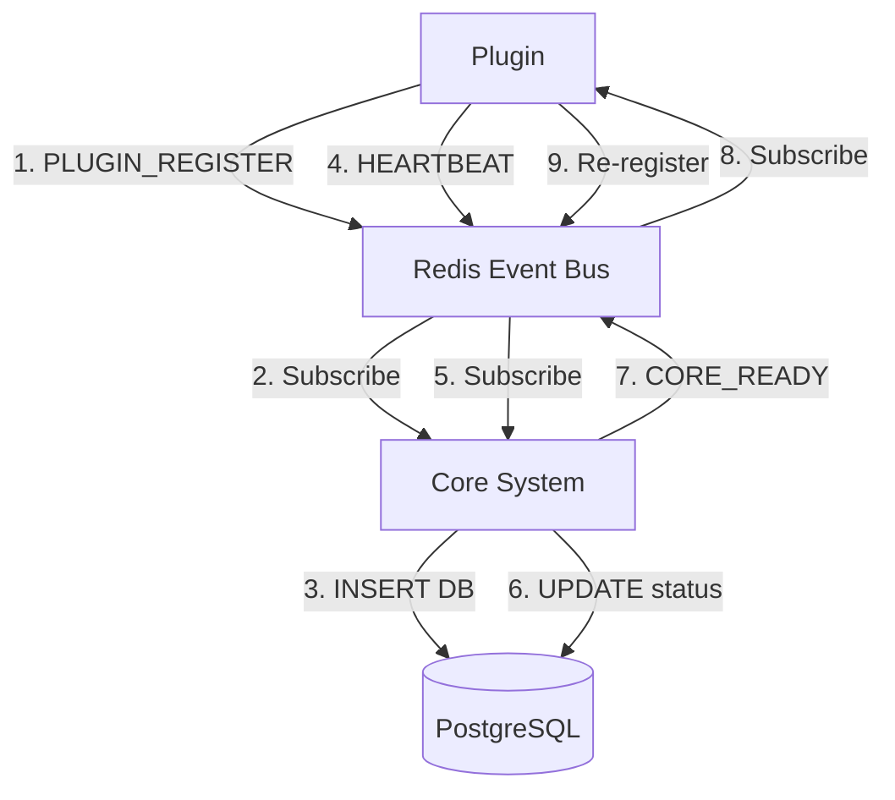

# Protocolo de Comunicación del Sistema GestasAI

**Versión**: 1.0  
**Fecha**: 22 de Noviembre de 2025

---

## 🎯 Arquitectura de Comunicación



---

## 📡 Canales Redis

### 1. SYSTEM:PLUGIN_REGISTER

**Propósito:** Registro inicial de plugins

**Publisher:** Plugins  
**Subscriber:** Core System (DiscoveryService)

**Payload:**
```json
{
    "key": "plugin-nombre",
    "name": "Nombre del Plugin",
    "version": "1.0.0",
    "description": "Descripción completa",
    "category": "WEB|SYSTEM|INTEGRATION|AI",
    "author": "Autor",
    "homepage": "/plugins/nombre",
    "icon": "IconName",
    "type": "FEATURE|SERVICE|INTEGRATION",
    "capabilities": ["cap1", "cap2"],
    "network": {
        "strategy": "docker_internal",
        "host": "gestas_plugin_nombre",
        "port": 5001,
        "health_check": "/health"
    },
    "ui": { ... },
    "database": { ... },
    "ai": { ... }
}
```

**Cuándo se envía:**
- Al arrancar el plugin (después de `app.listen()`)
- Al recibir `SYSTEM:CORE_READY`

**Procesamiento en Core:**
1. Valida manifest
2. Upsert en tabla `addons`
3. Insert/Update en tabla `plugins` (una fila por capability)
4. Cache en Redis: `ROUTE:{plugin-key}` → `http://host:port`
5. Log: "Successfully registered {plugin-key} ({N} plugins)"

---

### 2. SYSTEM:PLUGIN_HEARTBEAT

**Propósito:** Mantener plugins activos

**Publisher:** Plugins  
**Subscriber:** Core System (DiscoveryService)

**Payload:**
```json
{
    "key": "plugin-nombre",
    "timestamp": 1700000000000
}
```

**Frecuencia:** Cada 30 segundos

**Procesamiento en Core:**
```sql
UPDATE plugins 
SET status = 'ONLINE', last_heartbeat = NOW() 
WHERE key LIKE '{plugin-key}%'
```

**Importancia:**
- Reactiva plugins después de reinicio del core
- Mantiene status='ONLINE' en marketplace
- Permite detección de plugins caídos

---

### 3. SYSTEM:CORE_READY

**Propósito:** Notificar que el core se reinició

**Publisher:** Core System  
**Subscriber:** Todos los plugins

**Payload:**
```json
{
    "timestamp": 1700000000000,
    "version": "1.0.0"
}
```

**Cuándo se envía:**
- Al arrancar el core system
- Después de reconectar a Redis

**Acción en Plugins:**
```javascript
await this.redisSub.subscribe('SYSTEM:CORE_READY', (message) => {
    console.log('🔄 Core restarted. Re-registering...');
    PluginBootstrap.registerPlugin();
});
```

---

## 🔄 Flujos de Comunicación

### Flujo 1: Arranque Normal

```
1. Core arranca
   ↓
2. Core escucha SYSTEM:PLUGIN_REGISTER y SYSTEM:PLUGIN_HEARTBEAT
   ↓
3. Plugin arranca
   ↓
4. Plugin conecta a Redis
   ↓
5. Plugin publica SYSTEM:PLUGIN_REGISTER
   ↓
6. Core recibe y procesa registro
   ↓
7. Core inserta en DB con status='ONLINE'
   ↓
8. Plugin inicia heartbeat cada 30s
   ↓
9. Marketplace muestra plugin automáticamente
```

### Flujo 2: Core se Reinicia

```
1. Core se reinicia (plugins siguen corriendo)
   ↓
2. Core publica SYSTEM:CORE_READY
   ↓
3. Plugins reciben SYSTEM:CORE_READY
   ↓
4. Plugins re-publican SYSTEM:PLUGIN_REGISTER
   ↓
5. Core procesa registros
   ↓
6. Plugins continúan heartbeat
   ↓
7. Máximo 30s para reactivación completa
```

### Flujo 3: Plugin se Reinicia

```
1. Plugin se reinicia (core sigue corriendo)
   ↓
2. Plugin conecta a Redis
   ↓
3. Plugin publica SYSTEM:PLUGIN_REGISTER
   ↓
4. Core procesa (ON CONFLICT DO UPDATE)
   ↓
5. Status cambia a 'ONLINE'
   ↓
6. Plugin inicia heartbeat
   ↓
7. Aparece en marketplace inmediatamente
```

---

## 🗄️ Persistencia en Base de Datos

### Tabla: addons

```sql
CREATE TABLE addons (
    id UUID PRIMARY KEY,
    key VARCHAR(100) UNIQUE NOT NULL,
    name VARCHAR(255) NOT NULL,
    description TEXT,
    icon_url VARCHAR(255),
    category VARCHAR(50),
    author VARCHAR(255),
    homepage VARCHAR(255),
    version VARCHAR(50),
    is_system BOOLEAN DEFAULT FALSE
);
```

**Datos desde manifest:**
- `key` → manifest.key
- `name` → manifest.name
- `description` → manifest.description
- `icon_url` → manifest.icon
- `category` → manifest.category
- `author` → manifest.author
- `homepage` → manifest.homepage
- `version` → manifest.version

### Tabla: plugins

```sql
CREATE TABLE plugins (
    id UUID PRIMARY KEY,
    addon_id UUID REFERENCES addons(id),
    key VARCHAR(100) UNIQUE NOT NULL,
    name VARCHAR(255) NOT NULL,
    type VARCHAR(50) NOT NULL,
    base_price DECIMAL(10, 2) DEFAULT 0.00,
    capabilities JSONB DEFAULT '[]',
    network_config JSONB,
    ai_config JSONB,
    status VARCHAR(50) DEFAULT 'OFFLINE',
    last_heartbeat TIMESTAMP WITH TIME ZONE
);
```

**Una fila por capability:**
- `key` → `{addon-key}-{capability}`
- `name` → `{addon-name} - {capability}`
- `capabilities` → `["{capability}"]`
- `status` → `'ONLINE'` (desde INSERT)
- `last_heartbeat` → NOW()

---

## 🔍 Cache en Redis

### ROUTE:{plugin-key}

**Propósito:** Gateway routing

**Formato:**
```
ROUTE:plugin-auth → http://gestas_plugin_auth:3004
ROUTE:plugin-auth-auth:login → http://gestas_plugin_auth:3004
ROUTE:plugin-content → http://gestas_plugin_content:5001
```

**Uso en Gateway:**
```javascript
const targetUrl = await redis.get(`ROUTE:${pluginKey}`);
proxy.web(req, res, { target: targetUrl });
```

---

## 🌐 Endpoints de Plugin

### Obligatorios

#### GET /health

**Propósito:** Health check

**Response:**
```json
{
    "status": "UP",
    "plugin": "plugin-nombre",
    "version": "1.0.0"
}
```

#### GET /meta

**Propósito:** Metadata del plugin

**Response:** Manifest completo

#### GET /api/ai/context

**Propósito:** Contexto para AI

**Response:**
```json
{
    "summary": "Estado actual del plugin",
    "last_event": "Último evento relevante",
    "data": { ... }
}
```

---

## 🔐 Variables de Entorno

### Plugins

```bash
PORT=5001                                    # Puerto del plugin
REDIS_URL=redis://gestas_event_bus:6379    # Redis event bus
DB_HOST=gestas_system_db                    # PostgreSQL host
DB_PORT=5432                                 # PostgreSQL port
DB_NAME=gestas_system                        # Database name
DB_USER=gestas_admin                         # DB user
DB_PASSWORD=system_password_secure           # DB password
HOST_IP=gestas_plugin_nombre                 # Docker service name
```

### Core System

```bash
PORT=4000
REDIS_URL=redis://gestas_event_bus:6379
DB_HOST=gestas_system_db
DB_PORT=5432
DB_NAME=gestas_system
DB_USER=gestas_admin
DB_PASSWORD=system_password_secure
```

---

## 📊 Monitoreo y Debugging

### Ver Plugins Registrados

```sql
SELECT 
    a.key as addon_key,
    a.name as addon_name,
    a.category,
    COUNT(p.id) as plugin_count,
    COUNT(CASE WHEN p.status = 'ONLINE' THEN 1 END) as online_count
FROM addons a
LEFT JOIN plugins p ON a.id = p.addon_id
GROUP BY a.id
ORDER BY a.name;
```

### Ver Heartbeats Recientes

```sql
SELECT 
    key,
    name,
    status,
    last_heartbeat,
    NOW() - last_heartbeat as time_since_heartbeat
FROM plugins
WHERE status = 'ONLINE'
ORDER BY last_heartbeat DESC;
```

### Ver Logs de Registro

```bash
# Core logs
docker logs gestas_core_system --tail 100 | grep "Discovery"

# Plugin logs
docker logs gestas_plugin_nombre --tail 50
```

---

## ⚠️ Errores Comunes

### Plugin no aparece en marketplace

**Síntomas:**
- Plugin dice "Registered with Core"
- NO aparece en logs del core
- Status = OFFLINE o no existe en DB

**Causas:**
1. Canal Redis incorrecto (`plugin:register` en lugar de `SYSTEM:PLUGIN_REGISTER`)
2. Redis URL incorrecta (no apunta a `gestas_event_bus`)
3. Payload mal formado

**Solución:**
```bash
# Comparar con plugin-auth
fc packages/plugin-auth/src/bootstrap/redis.js packages/plugin-nuevo/src/bootstrap/redis.js
```

### Plugin aparece como OFFLINE

**Síntomas:**
- Plugin registrado en DB
- Status = OFFLINE
- NO aparece en marketplace

**Causas:**
1. DiscoveryService INSERT no incluye status='ONLINE'
2. Heartbeat no funciona

**Solución:**
```sql
-- Verificar INSERT en DiscoveryService.js incluye:
INSERT INTO plugins (..., status, last_heartbeat)
VALUES (..., 'ONLINE', NOW())
```

### Core no recibe heartbeats

**Síntomas:**
- Plugin envía heartbeat (logs)
- Core no actualiza last_heartbeat

**Causas:**
1. Canal incorrecto (`plugin:heartbeat` en lugar de `SYSTEM:PLUGIN_HEARTBEAT`)
2. Core no escucha el canal

**Solución:**
```javascript
// Verificar en DiscoveryService.js:
await subscriber.subscribe('SYSTEM:PLUGIN_HEARTBEAT', async (message) => {
    const { key } = JSON.parse(message);
    await this.db.query(`
        UPDATE plugins SET status = 'ONLINE', last_heartbeat = NOW() 
        WHERE key LIKE $1
    `, [`${key}%`]);
});
```

---

## 🎯 Mejores Prácticas

1. **Usar canales estándar** - NUNCA inventar canales propios
2. **Enviar payload completo** - Usar spread operator `...manifest`
3. **Heartbeat constante** - Cada 30s sin falta
4. **Logs descriptivos** - Facilita debugging
5. **Manejo de errores** - Try-catch en todas las operaciones Redis
6. **Reconexión automática** - Si Redis falla, reintentar
7. **Validación de payload** - Verificar campos obligatorios antes de enviar

---

**Última actualización**: 22 de Noviembre de 2025  
**Mantenido por**: GestasAI Team
